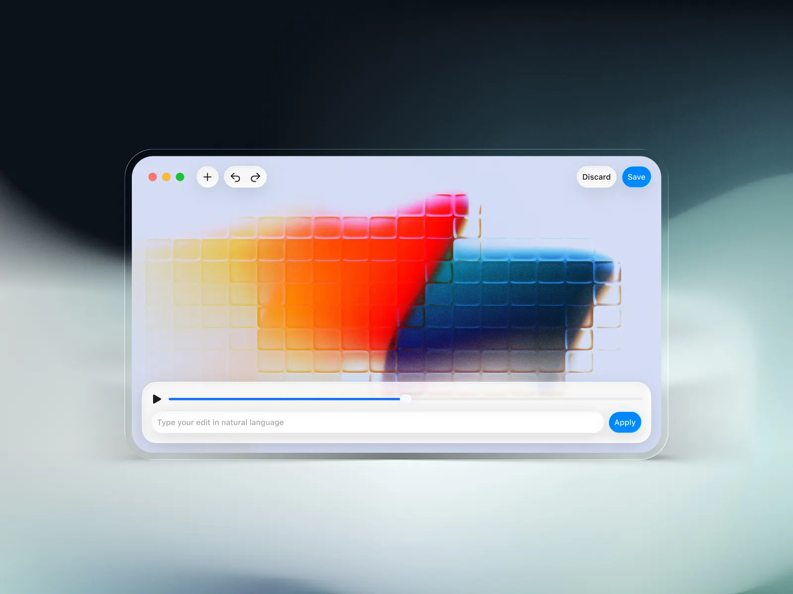

# PromptCut

A macOS video editor controlled entirely by natural language. Drop a video, type what you want, and PromptCut translates your words into ffmpeg commands — no timelines, no menus, no learning curve.

**Website & Download:** [promptcut.legault.me](https://promptcut.legault.me/)

## How it works

1. Drop a video (or click "Choose file")
2. Type a command like `trim video from 0:30 to 1:00`
3. PromptCut runs it and shows the result instantly

## Supported commands

| Command | Example |
|---|---|
| Trim / Cut | `trim video from 0:30 to 1:00` |
| Convert | `convert video to mp4`, `convert video to gif`, `convert video to mp3` |
| Compress | `compress video to 10mb` |
| Resize | `resize video to 720p`, `resize video to 1280x720` |
| Crop | `crop video to 1280x720` |
| Speed | `speed up video by 2x`, `slow down video by 2x` |
| Reverse | `reverse video` |
| Mute | `mute video` |
| Extract audio | `extract audio from video` |
| Rotate | `rotate video by 90` |
| Flip | `flip video horizontal`, `flip video vertical` |
| Thumbnail | `thumbnail video at 0:05` |
| FPS | `fps video to 30` |
| Loop | `loop video 3 times` |
| Stabilize | `stabilize video` |
| Denoise | `denoise video` |
| Grayscale | `grayscale video` |
| Merge | Drop multiple videos to merge them in order |

## Features

- Undo / redo history for every edit
- Real-time progress bar with ffmpeg output
- Hardware-accelerated encoding via VideoToolbox
- Merge multiple clips with automatic resolution and audio normalization
- GIF export with smart palette generation
- Drag and drop support
- Built-in cheat sheet

## Requirements

- macOS 14.0+
- ffmpeg (bundled in the app, or install via `brew install ffmpeg`)

## Building from source

1. Clone the repo
2. Open `PromptCut/PromptCut.xcodeproj` in Xcode
3. Build and run

The project includes a `download-ffmpeg.sh` script and a build phase to sign the bundled ffmpeg binary.

## Privacy

PromptCut collects anonymous usage analytics via PostHog to understand which features are popular and where errors occur. **No filenames, file paths, or command text is ever collected** — only metadata like command category (e.g. "trim", "compress"), processing time, and file format.

## License

All rights reserved.
